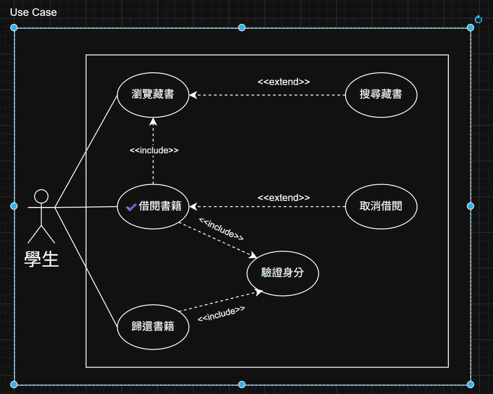

## 暑期系統分析作業-約會交友系統

### Use Case Diagram (UCD)

### 使用案例規格

| 項目           | 說明                                                                                                                                                                                                                                                                        |
| -------------- | --------------------------------------------------------------------------------------------------------------------------------------------------------------------------------------------------------------------------------------------------------------------------- |
| **名稱**       | 發起交友邀請                                                                                                                                                                                                                                                                |
| **摘要描述**   | 用戶設定對象篩選條件後，系統顯示符合條件的對象列表。用戶選擇屬意對象後送出交友邀請，系統建立邀請紀錄並通知受邀會員。                                                                                                                                                        |
| **主要動作者** | 系統用戶                                                                                                                                                                                                                                                                    |
| **支援動作者** | —                                                                                                                                                                                                                                                                           |
| **前置條件**   | 用戶已註冊並登入系統                                                                                                                                                                                                                                                        |
| **主流程**     | 1. 會員進入系統選擇發起交友邀請功能 2. 系統顯示篩選條件輸入表單。 3. 會員輸入並確認條件。 4. 系統驗證資料格式無誤，顯示符合條件的對象列表。 5. 會員檢視列表並選擇對象「發送邀請」。 6. 系統建立邀請紀錄並發送通知給受邀會員。 7. 系統回覆「邀請已送出」。 |
| **後置條件**   | - 用戶`Invitations` 表新增一筆狀態 = `Pending` 的紀錄。  - 受邀用戶收到推播或 Email 通知。                                                                                                                                                                              |
| **替代流程**   | 4a. 無符合條件對象 : 系統顯示「目前無符合條件對象」。                                                                                                                                                                                                                       |
| **特殊需求**   | 單一會員每日最多 10 則邀請，超過則提示已達上限。                                                                                                                                                                                                                            |
