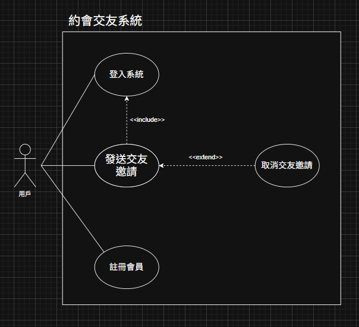

## 暑期系統分析作業-自助借書系統

### Use Case Diagram (UCD)

### 使用案例規格

| 項目        | 說明                                                                         |
| --------- | -------------------------------------------------------------------------- |
| **名稱**    | 借閱圖書                                                                       |
| **摘要描述**  | 學生在瀏覽或搜尋圖書後，直接點擊「借閱」按鈕，系統顯示「借閱成功」及歸還日期。                                    |
| **主要動作者** | 學生                                                                         |
| **支援動作者** | —                                                                          |
| **前置條件**  | - 學生已通過系統驗證符合借書資格。 - 學生已瀏覽或查詢預借閱之書籍，並已確認該書及詳細資訊。                        |
| **主流程**   | 1. include::瀏覽書籍。 2. 查看書籍詳細資訊。 3. 點擊「借閱」按鈕。 4. 系統顯示「借閱成功」訊息與歸還期限。 |
| **後置條件**  | - 書籍狀態更新為「已借出」。 - 學生借閱紀錄增加一筆新資料。                                        |
| **替代流程**  | 3a.若圖書已被借出，系統提示「此書目前不可借閱」。                                                 |
| **特殊需求**  | - 借閱期限為 30 日。 - 借閱期限屆滿前3 日系統以email寄送到期提醒。                               |